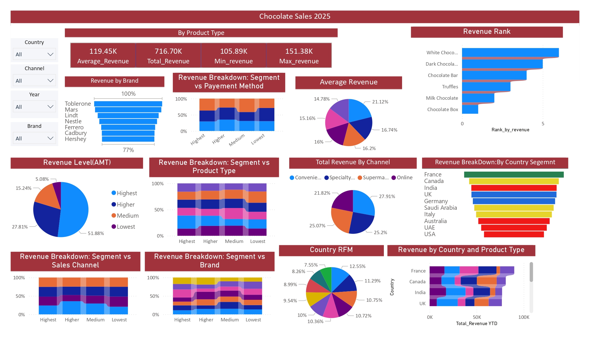

# 🍫 Chocolate Sales Dashboard – Power BI


An interactive **Power BI dashboard** that analyzes chocolate sales across **brand, product type, country, sales channel, and payment method**.

This project showcases **data analysis, data modeling, DAX, and business intelligence skills**, including advanced techniques like **RFM segmentation** and **revenue-based transaction classification**.

📄 **PDF Report**: [Chocolate_sales_dashboard.pdf](./Chocolate_sales_dashboard.pdf)

---

## 📊 Dashboard Preview



> ⚠️ Make sure you upload your screenshot to: `images/chocolate_dashboard.png`

---

## 🎯 Business Objective

The dashboard is designed to:

- Identify **top-performing brands, products, and regions**
- Track **sales trends over time**
- Segment markets using **RFM analysis**
- Classify transactions based on **revenue contribution**
- Enable **data-driven decision-making**

---

## 📁 Dataset

The dataset contains chocolate sales transactions with the following structure:

| Column | Description |
|--------|-------------|
| `Sale_ID`, `Date` | Transaction details |
| `Brand`, `Product_Type` | Product information |
| `Country`, `Sales_Channel`, `Payment_Method` | Sales context |
| `Price_USD`, `Units_Sold`, `Revenue_USD` | Key performance metrics |

---

## 📐 Key Features & Analysis

### 🔹 RFM Segmentation (Country-Level)

RFM analysis evaluates country performance using:

- **Recency** → Days since last purchase  
- **Frequency** → Number of transactions  
- **Monetary** → Total revenue  

Countries are scored (1–4) and grouped into:

- 🏆 Champions  
- 💡 Loyal Customers  
- 🌱 Potential Loyalists  
- ⚠️ Needs Attention  
- 🔻 At Risk  

👉 Helps prioritize **marketing and retention strategies**

---

### 🔹 Revenue Segmentation

Transactions are grouped into quartiles:

- **Lowest (≤ Q25)**  
- **Medium (Q25–Q50)**  
- **Higher (Q50–Q75)**  
- **Highest (> Q75)**  

👉 Helps identify **high-value transactions**

---

## 📊 Key Insights

- 📌 **Top Brand**: Cadbury leads in revenue  
- 🍫 **Top Product**: Milk Chocolate dominates sales  
- 🌍 **Top Country**: France classified as *Champion* (RFM)  
- 🛒 **Top Channel**: Convenience stores lead transactions  
- 💳 **Payment Method**: Cash is most commonly used  

---

## 📐 Sample DAX Measures

```DAX
Total Revenue = SUM(Sales[Revenue_USD])

Total Orders = COUNT(Sales[Sale_ID])

Average Price = AVERAGE(Sales[Price_USD])
